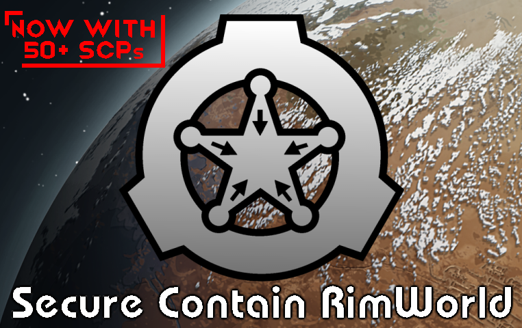

# What is it?

[RimWorld](https://store.steampowered.com/app/294100/RimWorld/) mod that adds stuff from the [SCP Foundation](http://www.scpwiki.com) project. Includes creatures, weapons, apparel, objects, factions, buildings, research projects, furniture, and containment procedures.

Here's some links:

STEAM  NEXUSMODS

[Trello](https://trello.com/b/k7sHcryO/scr) for upcoming features and other things like that

# Features

Adds several species of SCPs to wander the Rim; either neutral or outright hostile to your colonists lives.

Adds anomalous weapons and apparel that add all sorts of effects. From a pistol that turns headshots into meals to a katana that makes a pawn crazy with power, you'll be surprised what you'll find in the hands of raiders or deep in ancient ruins.

Adds event(s) and factions so your storyteller keeps you on your toes. From [SCP-3199](https://scp-wiki.wikidot.com/scp-3199) attacks to Chaos Insurgency [SCP-3033](https://scp-wiki.wikidot.com/scp-3033) raids, you'll see the weaponized forms of SCPs you'll be tempted to use too.

Adds non-anomalous gear and apparel to help capture SCPs and keep those D-Class in their place.

Also adds special 'containment procedures' for almost all anomalous entities that can appear. From simple powered shelves that keep an object from degrading to specialized walls and security doodads to lock up the nastiest the Rim has to offer. Don't forget: If it has a will of it's own, it will probably try to escape! Though not all SCPs have to be contained... after all, [SCP-5185](https://scp-wiki.wikidot.com/scp-5185)s are good boys with a little training.

Pay attention to an object's classifications to ensure the safety of your colonists. Or don't. There are three classifications: Containment class, Disruption class, and Risk class. They help indicate what effects the SCP has at a glance, and each one is listed in an object's information menu. A Safe, Dark, Notice-classed SCP doesn't mean it isn't dangerous.

Some of the classifications may have been adjusted thanks to the Rim being quite different than the Foundation's normal stomping grounds.

While knowing the SCP's entry can help in some cases, it isn't essential to play this mod.

# Current SCPs you can encounter (in varying levels of finished)

SCP-113, SCP-127, SCP-250, SCP-262, SCP-475, SCP-529, SCP-572, SCP-762, SCP-3033 (1 and 2), SCP-3118, SCP-3199, SCP-5185

# Credits

Programming + art by DeeMainiac

Content relating to the SCP Foundation, including the SCP Foundation logo, is licensed under [Creative Commons Sharealike 3.0](https://creativecommons.org/licenses/by-sa/3.0/) and all concepts originate from http://www.scpwiki.com and its authors. This includes the sprites/xml in this project as well. However, keep in mind most sprites I've done for this project are spliced, so I don't recommend using them anywhere but for the context of RimWorld.

# Contact

Send a bug report right here on GitHub

@me on the RimWorld discord (DeeMainiac#2893) preferably in #mod-general 
